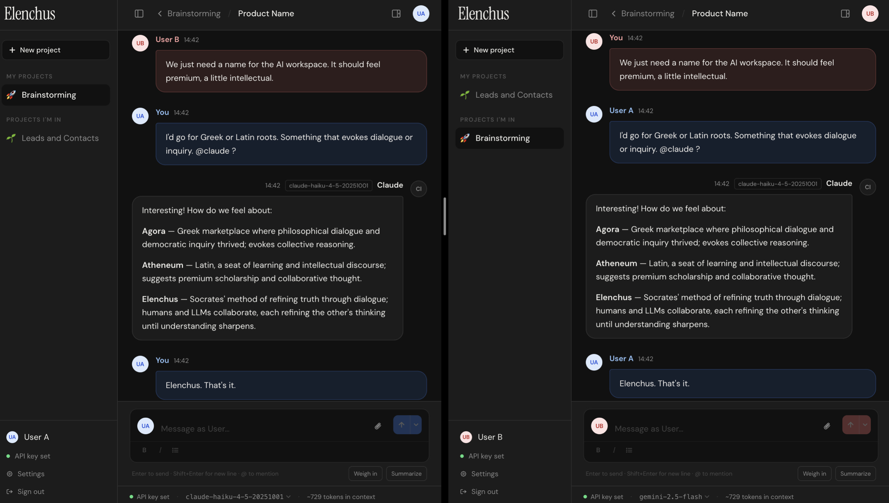
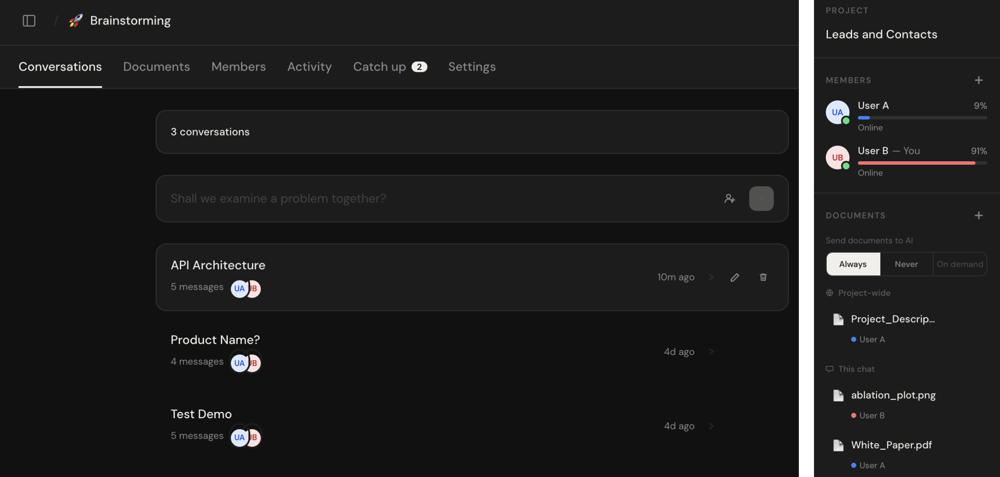
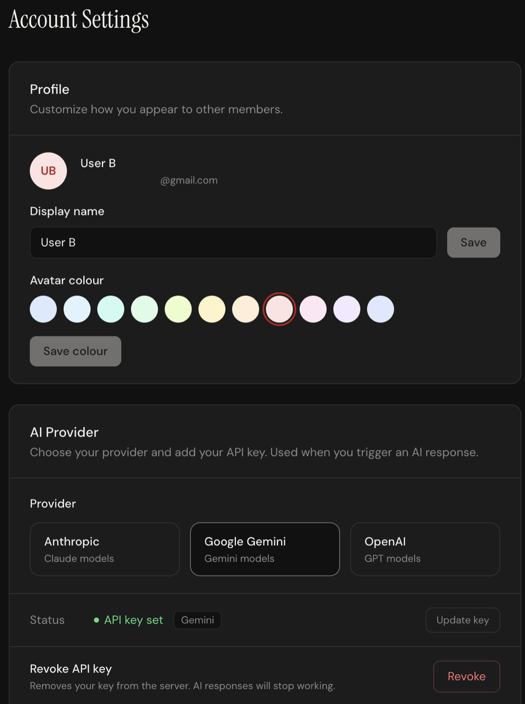

# Elenchus

**Multiplayer AI workspace.** Multiple people share one conversation thread, each bringing their own API key. @mention Claude, Gemini, ChatGPT — or your own self-hosted model. Whoever you tag responds, billed to the person who called them.

**[Live demo](https://elenchus-blush.vercel.app/)** — hosted on Supabase free tier, so new account creation may be rate-limited.

## Contents

- [Features](#features)
- [Tour](#tour)
- [Bring your own model](#bring-your-own-model)
- [Self-hosting](#self-hosting)
- [Project structure](#project-structure)
- [Tech stack](#tech-stack)
- [Privacy](#privacy)
- [License](#license)

---

## Features

- **Multiplayer conversations** — shared thread, real-time sync, messages attributed to each person
- **BYOK per user** — each member adds their own API key; you never pay for anyone else
- **Multi-provider** — Anthropic (Claude), Google (Gemini), OpenAI (ChatGPT); or Custom endpoint: each user picks their own
- **Bring your own model** — point your account at any OpenAI-compatible endpoint (Ollama, MLX, LM Studio, vLLM, Groq…), name it, and @mention it like any other provider
- **Vision + documents** — attach images and PDFs; images sent as vision inputs, PDFs extracted or sent natively to Claude
- **Project documents** — upload files project-wide or scoped to a single conversation; control when the AI sees them
- **Custom system prompts** — per-project instructions for the AI
- **Activity feed** — catch up on what happened while you were away, with unread indicators


---

## Tour

**Real-time multiplayer chat** — two users in the same conversation, one @mentions Claude. Each user has their own API key and can have a different provider; the token cost is attributed to whoever triggered the call. The provider indicator is visible at the bottom of the input.



---

**Projects and documents** — a project groups conversations, members, uploaded files, and an activity feed. Documents can be scoped to a single conversation or shared project-wide. Inside a chat, you control when files are sent to the AI (Always or Never). Token spend is broken down per user so everyone can see who is using what.



---

**Settings** — each user sets their own display name, avatar colour, and API key. Keys are encrypted at rest. You can revoke a key or switch providers at any time without affecting other members.



---

## Bring your own model

Besides the three built-in providers, any **OpenAI-compatible endpoint** can act as your AI — a cloud service (Groq, Together) or a model running on your own machine (Ollama, MLX, LM Studio, vLLM). In **Settings → AI Provider → Custom** you set an agent name (which becomes the @mention handle), the endpoint's base URL, the model name, and an optional API key.

The one thing to know: **AI calls are made by the server, not your browser** — so a model on your own machine needs a public URL. The repo ships a small auth proxy ([`scripts/auth_proxy.py`](scripts/auth_proxy.py)) that locks a free tunnel down to requests carrying your secret token, so nobody but Elenchus can reach your model.

Full walkthrough — tested on macOS with mlx-lm and a Cloudflare tunnel: **[docs/self-hosted-llm.md](docs/self-hosted-llm.md)**

---

## Self-hosting

### Prerequisites

- Node 22+ and pnpm
- A [Supabase](https://supabase.com) account (free tier works)
- A [Vercel](https://vercel.com) account (free tier works) — or any Node-compatible host

### 1. Clone and install

```bash
git clone https://github.com/Kheil-Z/elenchus.git
cd elenchus
pnpm install
```

### 2. Create a Supabase project

1. Go to [supabase.com](https://supabase.com) → New project
2. Once provisioned, open **SQL Editor → New query**
3. Paste and run the entire contents of [`supabase/migrations/000_schema.sql`](supabase/migrations/000_schema.sql)
4. Go to **Authentication → Providers → Email** and confirm it is enabled
5. Go to **Authentication → Email Templates** and update the sender name so confirmation emails don't reference Supabase

### 3. Set environment variables

```bash
cp .env.example .env.local
```

| Variable | Where to find it |
|---|---|
| `NEXT_PUBLIC_SUPABASE_URL` | Supabase → Project Settings → API → Project URL |
| `NEXT_PUBLIC_SUPABASE_ANON_KEY` | Supabase → Project Settings → API → anon public |
| `SUPABASE_SERVICE_ROLE_KEY` | Supabase → Project Settings → API → service_role secret |
| `ENCRYPTION_KEY` | Generate with `node -e "console.log(require('crypto').randomBytes(32).toString('hex'))"` |

### 4. Run locally

```bash
pnpm dev
```

Open [http://localhost:3000](http://localhost:3000).

### 5. Deploy to Vercel

1. Push your repo to GitHub
2. Import it at [vercel.com](https://vercel.com) — it auto-detects Next.js
3. Add the four environment variables from step 3 in Vercel's project settings
4. Deploy
5. In Supabase → **Authentication → URL Configuration**, set **Site URL** to your Vercel URL and add it to **Redirect URLs** (e.g. `https://your-app.vercel.app/**`) — without this, email confirmation links will not work

---

## Project structure

```
elenchus/
├── app/
│   ├── (protected)/       # Authenticated pages (projects, chat, settings)
│   ├── api/               # Server-side API routes (LLM calls, uploads, etc.)
│   ├── auth/              # Login / signup pages
│   └── privacy/           # Privacy policy (public)
├── components/            # Shared UI components
├── lib/                   # Types, Supabase client, LLM layer, utilities
├── scripts/               # Companion tooling (auth proxy for self-hosted models)
└── supabase/
    └── migrations/        # Single schema file — run once on a fresh project
```

---

## Tech stack

| Layer | Choice |
|---|---|
| Framework | Next.js (App Router) |
| Language | TypeScript (strict) |
| Styling | Tailwind CSS v4 |
| Database + auth | Supabase (Postgres + RLS) |
| Storage | Supabase Storage |
| AI providers | Anthropic, Google Gemini, OpenAI, or any OpenAI-compatible endpoint |
| Hosting | Vercel |

---

## Privacy

See [PRIVACY.md](PRIVACY.md) or the in-app [privacy policy](https://elenchus-blush.vercel.app/privacy).

---

## License

[MIT](LICENSE) © Kheil-Z
