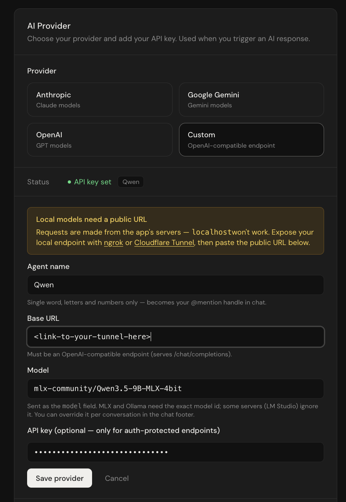

# Bring your own model

Elenchus can use **any OpenAI-compatible endpoint** as an AI provider — a cloud service like Groq or Together, or a model running on your own machine with Ollama, MLX, LM Studio, or vLLM. You give your model a name, and it becomes an @mention in your conversations, exactly like `@claude` or `@gemini`.

This guide covers both paths. The self-hosted walkthrough was tested end-to-end on macOS (Apple Silicon) with `mlx-lm` and a Cloudflare quick tunnel.

---

## How it works

In **Settings → AI Provider → Custom** you configure four fields:

| Field | Meaning | Example |
|---|---|---|
| **Agent name** | Your AI's display name and @mention handle. Single word, letters and numbers. | `Llama` → you type `@Llama` in chat |
| **Base URL** | The endpoint root. Elenchus appends `/chat/completions` to it. | `https://api.groq.com/openai/v1` |
| **Model** | Sent as the `model` field in every request. Some servers require it (MLX, Ollama, vLLM, all cloud services); some ignore it (LM Studio, llama.cpp). Can be overridden per conversation in the chat footer. | `llama-3.3-70b-versatile` |
| **API key** | Optional. When set, sent as `Authorization: Bearer <key>`. Leave blank for endpoints without auth. | — |

Here's the form filled in for a self-hosted MLX model behind a tunnel:



One thing determines everything else in this guide:

> **AI calls are made by the Elenchus server, not by your browser.**  To use a local model, you expose it through a tunnel, and this guide shows how to do that without exposing it to anyone but Elenchus.

---

## Path 1 — Cloud services (the easy path)

Any OpenAI-compatible cloud API works directly. For example:

| Service | Base URL | API key | Model |
|---|---|---|---|
| Groq | `https://api.groq.com/openai/v1` | your Groq key | e.g. `llama-3.3-70b-versatile` |
| Together | `https://api.together.xyz/v1` | your Together key | e.g. `meta-llama/Llama-3.3-70B-Instruct-Turbo` |

Fill in the four fields, save, and @mention your agent. Done — the rest of this guide is for self-hosting.

---

## Path 2 — A model on your own machine

### The architecture

```
Elenchus (server) ──HTTPS──▶ tunnel (free, any vendor — just moves bytes)
                                 │
                                 ▼
              your machine: auth proxy on 127.0.0.1:8090   ← checks the Bearer token, rejects everything else
                                 │
                                 ▼
              your machine: model server on 127.0.0.1:8080   (never exposed, not even to the tunnel directly)
```

The tunnel is treated as untrusted transport. The actual lock is [`scripts/auth_proxy.py`](../scripts/auth_proxy.py) — a small, dependency-free Python proxy you run yourself. It rejects any request that doesn't carry your secret token (using a constant-time comparison) and forwards the rest to the model server. Elenchus sends the token automatically: it's just the API key field.

Because the auth lives in code you run, the tunnel vendor is interchangeable — Cloudflare quick tunnel (no account needed), Tailscale Funnel, or ngrok's free tier all work identically.

### Step 1 — run a model server

Any OpenAI-compatible server works. With [mlx-lm](https://github.com/ml-explore/mlx-lm) on Apple Silicon:

```bash
pip install mlx-lm
mlx_lm.server --model mlx-community/Llama-3.2-1B-Instruct-4bit --port 8080
```


Using a different server? See [other model servers](#other-model-servers) for ports and model-field notes.

### Step 2 — generate an access token

```bash
export PROXY_TOKEN=$(openssl rand -hex 32)
echo "$PROXY_TOKEN"
```

Save the token somewhere private and **reuse it across sessions** — it's also what you'll paste into the API key field, and keeping it stable means you only ever re-enter the tunnel URL.

### Step 3 — start the auth proxy

Get the proxy — either from a clone of this repo (`scripts/auth_proxy.py`) or as a single file:

```bash
curl -O https://raw.githubusercontent.com/Kheil-Z/elenchus/main/scripts/auth_proxy.py
```

Then, in the same terminal where you exported `PROXY_TOKEN`:

```bash
python3 auth_proxy.py --listen-port 8090 --upstream-port 8080
```

What it does:

- binds to `127.0.0.1` only — on its own it's unreachable even from your Wi-Fi network
- returns 403 for any request without `Authorization: Bearer $PROXY_TOKEN`
- forwards authorized requests to the model server, stripping the token so the model server never sees it
- logs every request with its duration — `OK`, `DENIED`, or `CLIENT GONE` — so this terminal is your audit trail
- refuses to start if `PROXY_TOKEN` is unset or too short

### Step 4 — open a tunnel to the proxy port

```bash
brew install cloudflared 
cloudflared tunnel --url http://127.0.0.1:8090
```

It prints a random public URL like `https://random-words.trycloudflare.com`. Two things to know:

- **Tunnel port 8090, not 8080.** Tunneling the model server's port directly would bypass the auth proxy.
- **The URL changes on every cloudflared restart** (including after your laptop sleeps). Each new session means re-saving the Base URL in Settings. Tailscale Funnel (`tailscale funnel 8090`) gives a stable URL if that gets old.

### Step 5 — configure Elenchus

Settings → AI Provider → **Custom**:

- **Agent name**: e.g. `Llama`
- **Base URL**: `https://<tunnel-url>/v1`
- **Model**: the exact id you launched the server with, e.g. `mlx-community/Llama-3.2-1B-Instruct-4bit`
- **API key**: your `$PROXY_TOKEN` value

### Step 7 — chat

Send `@Llama hello, who are you?` in any conversation. The proxy terminal logs the request with its generation time; the reply appears in chat attributed to your agent.

If the conversation has attached documents, note that images are sent as vision inputs — a text-only model may reject them. Set the document toggle to **Never** in that conversation, or use a vision-capable model.

---

## Other model servers

| Server | Default port | Base URL (before tunneling) | Model field |
|---|---|---|---|
| mlx-lm | 8080 | `http://127.0.0.1:8080/v1` | **Required** — the exact id passed to `--model`. A wrong name makes MLX try to download it from HuggingFace and fail. |
| Ollama | 11434 | `http://127.0.0.1:11434/v1` | **Required** — a pulled tag, e.g. `llama3.2:1b`. Use `--upstream-port 11434` for the proxy. |
| LM Studio | 1234 | `http://127.0.0.1:1234/v1` | Ignored — serves whatever is loaded. Can be left blank. |
| vLLM | 8000 | `http://127.0.0.1:8000/v1` | **Required** — must match the served model name. |
| llama.cpp (`llama-server`) | 8080 | `http://127.0.0.1:8080/v1` | Ignored. Can be left blank. |

---

## The timeout budget

The whole chain must finish before the slowest waiting party gives up:

- Elenchus's AI route allows up to **60 seconds** on Vercel (the Hobby-plan maximum).
- Cloudflare's edge waits ~100 seconds for an origin response.

So generation needs to finish in **under ~60 seconds**. The proxy logs how long each request actually took. Keep in mind that Elenchus sends the system prompt plus the full conversation history, and lets the model generate freely (up to 4096 tokens) — a chatty model writes far more than a capped `curl` test does. If a warm model can't answer a short prompt in the budget, use a smaller or more quantized model.

---

## Troubleshooting

| Symptom | Cause | Fix |
|---|---|---|
| Instant error: `Tunnel unreachable (530)` | The saved Base URL points at a dead tunnel — quick-tunnel URLs change on every restart. The request never reached your machine. | Copy the current URL from the cloudflared terminal, update Settings → Base URL. |
| Error mentioning HuggingFace / `Repository Not Found` | The `model` field doesn't match what the server is running — MLX tried to download the unknown name. | Set the Model field (Settings, or the chat footer) to the exact served id. |
| `Custom endpoint 404 — check the model name …` | Wrong model name, or the Base URL is missing `/v1`. | Fix the model name; make sure the Base URL ends with `/v1`. |
| Proxy logs `CLIENT GONE … upstream answered 200 after Ns` | The model finished, but generation took longer than the caller's timeout (60s on Vercel, ~100s at Cloudflare's edge). | Use a smaller/faster model, or shorter prompts. See the timeout budget above. |
| `403` even with the token in curl | Token mismatch between the shell and the app — usually a stale `$PROXY_TOKEN` in a new terminal. | `echo $PROXY_TOKEN` in the proxy's terminal; make sure the app's API key matches it exactly. |
| Reply is fine in curl but slow in chat | Your curl capped `max_tokens` and asked for a short answer; Elenchus sends history + lets the model write freely. | Expected — see the timeout budget. |

---
